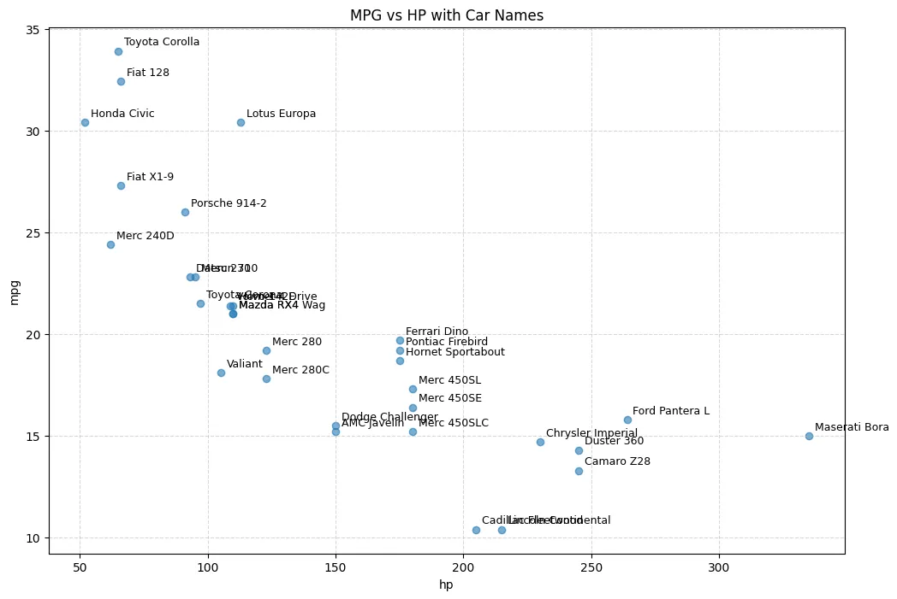
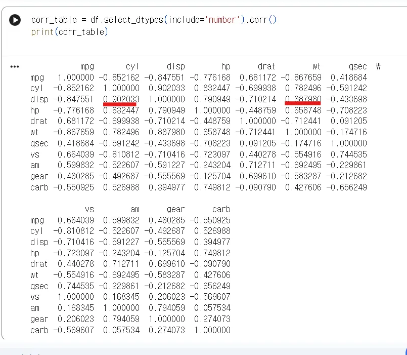
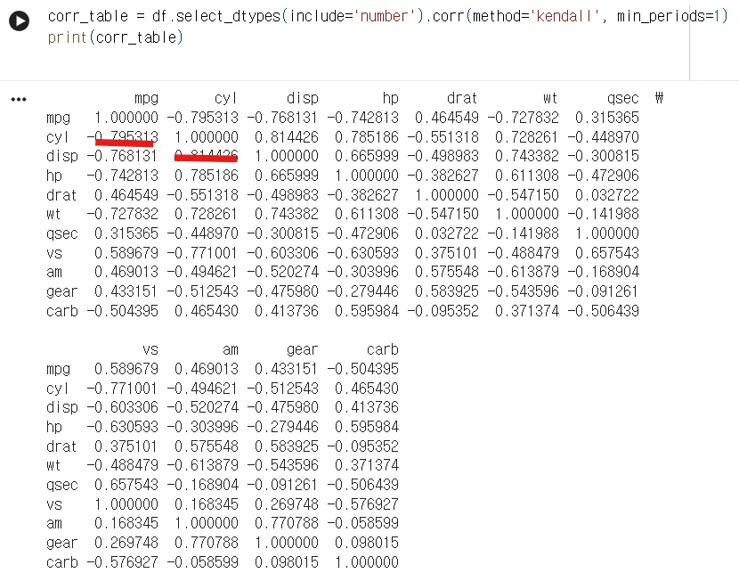
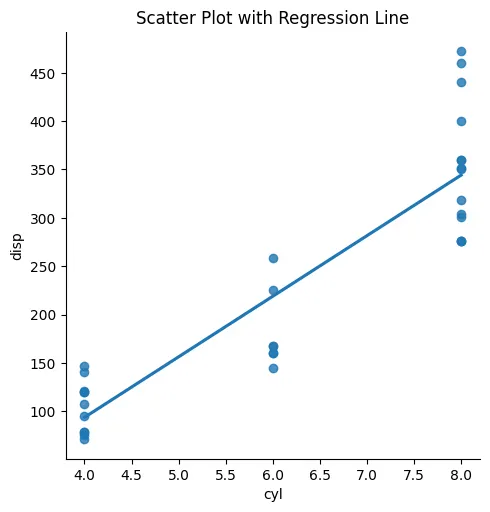
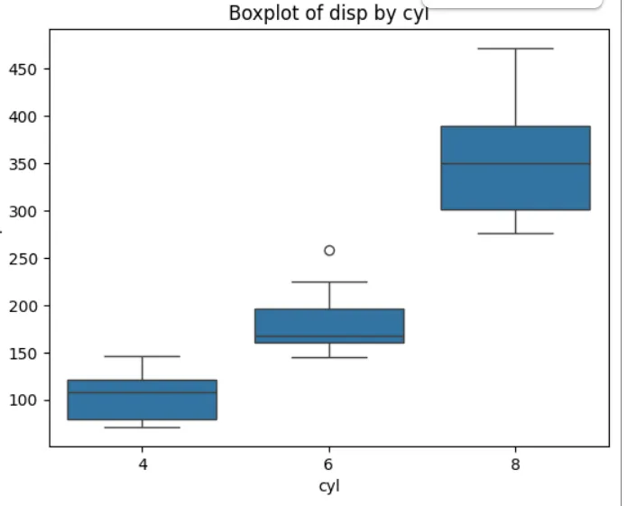
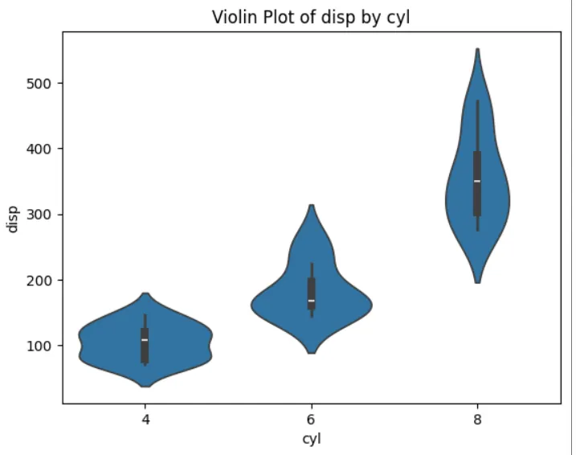
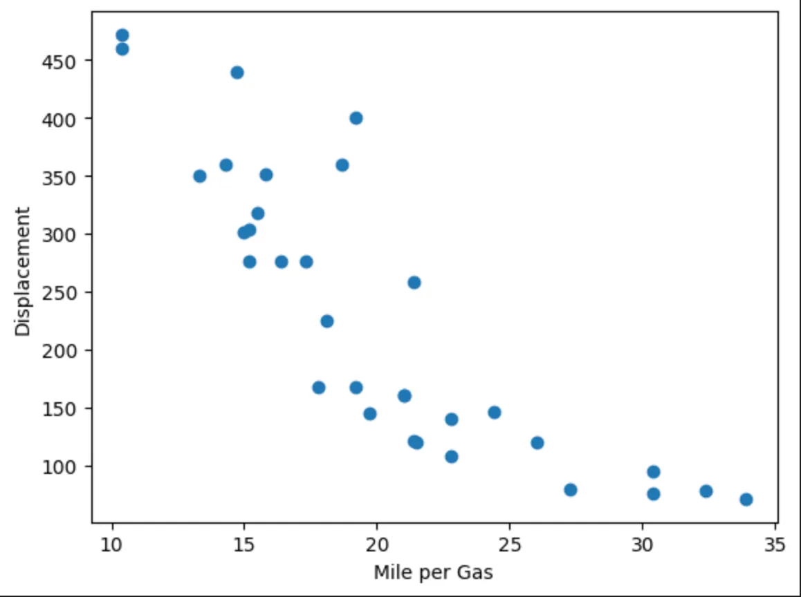
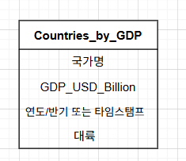

## Mission 1

**Q1. 이런 데이터셋을 분석해서 얻을 수 있는 경제적 가치는 무엇일까요? 어떤 비즈니스 상황에서 이런 데이터셋을 분석해서 어떤 경제적 가치를 얻을 수 있을까요?**

**한계**  
mtcars 데이터셋은 자체적으로 담고 있는 정보가 제한적이기 때문에, 해당 데이터만으로는 경제적 가치를 도출하는 데 한계가 있다고 판단했다.

다만, **추가적인 데이터와 결합**을 한다면 자동차 산업뿐만 아니라 다양한 분야로의 확장 및 활용 가능성이 있을 것으로 보인다.

**1. 자동차 제조사**

<연비·성능 분석>

자동차 제조사에서 차량의 여러 요소 간 관계를 분석하여 연비 관점에서 **효율적인 자동차 모델**을 회귀 분석 등을 통해 도출할 수 있다. 이를 통해 최근 강화되고 있는 환경 및 에너지 규제에 효과적으로 대응할 수 있다.

<시장 분석>

아래 그래프와 같이 시장에 출시된 경쟁사 차량 현황을 분석하여 **신차 출시 전략 수립**에 활용할 수 있다. 산점도 상에서 상대적으로 비어 있는 영역에 접근하여 모델의 라인업을 기획할 수 있다.

또한 자동차 설계 과정에서 **목표 성능 값을 설정하는 기준**으로도 활용 가능하다.

예를 들어, 우리 신차의 무게가 특정 수준일 경우 시장 경쟁력을 확보하기 위해 최소한 어느 정도의 마력을 확보해야 하는지를 판단할 수 있다.



<사용자 분석>

신차 개발을 위하여 데이터 분석을 수행할 경우 mtcars 데이터에 판매량 데이터를 결합하여 **사용자의 선택 경향**을 파악할 수 있다.

예를 들어, 고성능 차량일수록(hp, disp, qsec 값이 큰 경우) 수동 변속기를 선택하는 경향이 높다는 분석 결과가 도출될 수 있다. 이를 바탕으로, 고성능 차량 개발 시 수동 변속기 선택 옵션을 유지한다와 같은 의사결정으로 연결 할 수 있다.

**2. 보험**

보험료 책정 모델을 개발할 때, 차량별 고장 이력 데이터와 결합하여 분석을 수행할 수 있다.
예를 들어, cyl, carb(실린더 수와 카브레터 수)가 많은 차량일수록 고장 확률이 높다는 결론이 도출될 경우, "해당 차량 모델의 보험료를 인상한다"는 의사결정을 할 수 있다.

또한 hp, disp, qsec 등의 지표를 통해 마력과 배기량이 높을수록 고성능 차량으로 분류하고, 이를 차량 소유자의 연령 정보와 결합함으로써 위험도에 따라 보험료를 차등 조정하는 방식으로도 활용 가능하다.

**Q2. 변수들 간의 상관 관계가 높은 조합을 임의로 2개 선택해서 해당 데이터 간의 상관 관계를 그래프로 그리고 어떤 결론을 내릴 수 있는지를 토의하세요.**

변수 간 상관관계를 파악하기 위해 Pearson와 Kendall 상관계수 기법을 사용하였다.

<div style="display: flex; gap: 20px;">
  
  
</div>

우선, 대부분의 변수 조합이 물리 법칙에 기반한 예상 관계와 전반적으로 일치한다는 결론을 도출하였다.

1. **cyl - hp**

<div style="display: flex; justify-content: center; gap: 16px; flex-wrap: wrap;">
  
  
  
  
</div>

<br>

실린더 수가 많을수록 마력이 높아지는 경향을 보인다.

(다만, 동일한 기통 수 내에서도 마력의 분포 범위가 넓게 나타나,
다른 요인들 역시 마력에 큰 영향을 미친다는 점을 확인할 수 있다.)

2. **mpg - disp**

<div style="text-align: center;">
  
</div>

## Mission 2

**Q1. 각자가 이해하기 어려웠던, 또는 이해하지 못한 keyword에 대해서 함께 토의해 봅시다.**

**1. NOT IN vs NOT EXISTS**

- **_NOT IN_**

  - 서브쿼리 결과에 `NULL`이 하나라도 포함될 경우,
    비교가 성립되지 않아 **결과가 항상 0건(Empty Set)** 이 되는 문제가 발생할 수 있음
  - 예시
    ```sql
    WHERE ID NOT IN (1, 2, NULL);
    ```

- **_NOT EXISTS_**
  - 서브쿼리 결과에 `NULL`이 포함되어 있더라도,
    조건에 맞는 행을 **정상적으로 반환**
  - 예시
    ```sql
    WHERE NOT EXISTS (
        SELECT ID
        FROM 테이블
    );
    ```

---

### 2. Inner Join vs Outer Join

- 두 Join 방식은 결과에 포함되거나 손실되는 데이터 범위가 다르다.
- 사용 목적에 따라 각 Join 방식의 특성을 정확히 이해할 필요가 있다.

  ex) 한쪽 테이블의 데이터 보존이 필요한 경우

---

### 3. Window 함수

- `GROUP BY`와 달리, 원본 행 수를 유지한 채 누적합, 순위, 이동 평균 등의 분석이 가능하다.
- 실제 쿼리 예시를 확인하기

---

### 4. SELECT INTO

- 조회 결과를 새로운 테이블로 생성하는 방식
- CTE, View와의 차이점 구분
- View를 언제 사용하는 것이 좋은지.

---

### 5. Stored Procedure

- DB 내부에 저장되는 실행 가능한 SQL 로직이다.
- 쿼리의 재사용성과 성능 최적화 측면에서 활용 가능하다.

## Mission 3

**Q1. wikipeida 페이지가 아닌,
IMF 홈페이지에서 직접 데이터를 가져오는 방법은 없을까요?**

1. API를 통해 호출할 수 있다.
2. 웹사이트에서 데이터셋을 직접 다운로드할 수 있어,
   매크로를 활용한 자동화 방식 또한 가능할 것으로 보인다.

**API 호출 코드 – 미국 명목 GDP(연간)**

```python
# SDMX 라이브러리 설치
!pip install sdmx1

from sdmx import Client
import sdmx

# IMF SDMX API 클라이언트 생성
IMF = Client("IMF_DATA")

# 미국 연간 명목 GDP(NGDP) 데이터 조회
data = IMF.data(
    "WEO",
    key="USA.NGDP.A",
    params={"startPeriod": 2000, "endPeriod": 2024}
)

# Pandas DataFrame으로 변환
df = sdmx.to_pandas(data)
df.head()
```

IMF 데이터를 호출하기 위한 다양한 라이브러리가 존재한다. (imfp)


There’s a **universal bandwidth limit imposed on all traffic**.

- Serial calls on a single machine do not scale well.
- Multiple containers making parallel calls often make the situation even worse.
- There are several other APIs available, but many of them are **poorly documented**.

→ As a result, I spent a heck of a lot of time experimenting with **caching** and **rate limiting**.

[https://github.com/Promptly-Technologies-LLC/imfp/blob/main/docs/rate_limits.qmd](https://github.com/Promptly-Technologies-LLC/imfp/blob/main/docs/rate_limits.qmd)

### 요약

#### 1. IMF API 요청 제한 문제

IMF API는 **애플리케이션 단위로 초당 50회 요청 제한**을 적용한다. (2022년 기준)  
각 애플리케이션은 요청 헤더의 `"user_agent"` 값을 기준으로 구분되며,  
기본적으로 모든 `imfp` 사용자는 동일한 애플리케이션 이름을 공유한다.

#### 해결 방법

`imfp`는 애플리케이션 이름을 변경할 수 있도록  
`set_imf_app_name()` 함수를 제공한다.

- 해당 함수는 환경 변수 `IMF_APP_NAME`을 설정
- 이를 통해 API에 전달되는 애플리케이션 이름을 변경하여  
  요청 제한 문제를 완화할 수 있다.

※ 2025년 기준으로는 API 호출을 여러 번 전송하더라도 잘 동작하는 것으로 확인된다.

#### 2. 짧은 시간 내 다수 요청 문제

짧은 시간에 여러 요청을 전송할 경우,  
요청 제한(rate limit)에 의해 실패가 발생할 수 있다.

#### 해결 방법

`set_imf_wait_time()` 함수를 사용하여  
요청 간 wait time을 조절할 수 있다.

또한 `imfp`는 요청 실패 시  
지수 백오프(exponential backoff) 방식을 통해 재시도를 자동 처리한다.

**동작 방식**

1. 지정된 시간만큼 대기
2. 요청 재시도
3. 실패할 때마다 대기 시간을 지수적으로 증가
4. 기본적으로 3회 시도 후 중단

#### 3. API 호출 횟수 최소화 (캐싱)

API 호출 횟수를 줄이기 위해 자주 사용하는 데이터는 로컬에 저장(캐싱)한다.

- 파일이 이미 존재하는 경우 → 로컬 파일에서 데이터 로드
- 파일이 존재하지 않는 경우 → API 호출 후 로컬에 저장

**Q2. 만약 데이터가 갱신되면 과거의 데이터는 어떻게 되어야 할까요? 과거의 데이터를 조회하는 게 필요하다면 ETL 프로세스를 어떻게 변경해야 할까요?**



- 지정된 컬럼 구조를 기반으로 테이블을 생성한다.
- ETL 프로세스에서는 기존 데이터를 덮어쓰지 않고 Append 방식으로 적재한다.

이를 통해 데이터의 시간별 스냅샷이 누적되어 과거 시점의 데이터 조회가 가능해진다.
