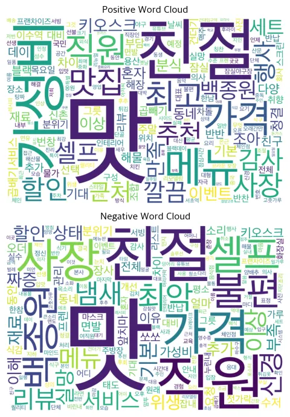
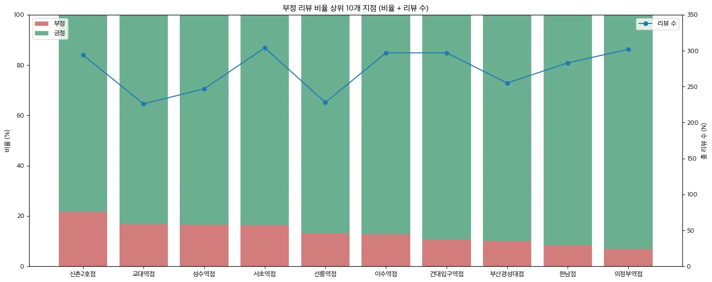
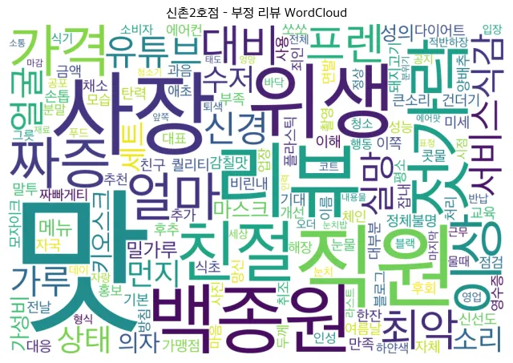
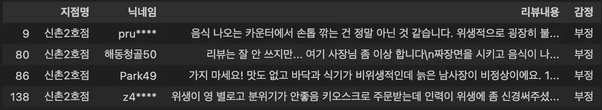

# Mission 5

### 유사한 데이터셋을 통해서 어떤 비즈니스 가치를 만들 수 있을지에 대해 토론

## 1. Sentiment140 데이터셋과 유사한 데이터셋을 활용한 비즈니스 가치 창출 아이디어

### 1) 소셜 데이터 기반 주니어 개발자 헤드헌팅 플랫폼

- IT 커리어 관련 소셜 데이터를 수집하고 정리
- 기업이 원하는 기술 스택과 개발자 성향을 프롬프트로 입력
- 요청을 수락할 가능성이 높은 주니어 개발자를 추천

### 2) 조직 리스크 조기 감지 시스템

- 협업툴에 남는 업무 텍스트를 분석해 팀의 스트레스와 위험 신호를 사전에 감지
- 이를 바탕으로 인력 배치나 일정 조정을 할 수 있도록 지원

### 3) 배달앱 데이터 기반 요식업 운영 코치 시스템

- 적자를 겪는 사장님이 광고, 할인, 메뉴 조정 같은 운영 결정을 감에 의존하지 않도록 지원
- 리뷰·메뉴·가격 등 공개 데이터를 수집해 경쟁 매장과 비교 분석
- 무엇을 바꿔야 하는지에 대한 전략 리포트 제공

## 2. 최종 선택 아이디어 및 선택 배경

### 선택 아이디어  
**리뷰 데이터를 활용해 점주가 운영 결정을 내릴 수 있도록 돕는 서비스**

### 선택 이유 1: 데이터 특성의 적합성

- 감성 분석용 데이터셋인 Sentiment140과 유사한 성격
- 리뷰 데이터는 고객의 실제 경험과 감정이 직접 반영된 텍스트 데이터이므로 감성 분석 활용도가 높다고 판단

### 선택 이유 2: 과제 요구사항과의 부합

- 본 미션은 Word Cloud 활용이 요구됨
- 리뷰 데이터는 키워드 중심 분석에 적합하고 핵심 이슈를 시각적으로 표현하기 용이함

## 3. 제안 시나리오

초기 아이디어는 경쟁 매장 비교 및 마케팅 전략 최적화 등 고도화된 정량 분석을 요구하여, 본 미션의 핵심 도구인 Word Cloud 기반 분석에는 적합하지 않았다.  
이에 따라 **텍스트 데이터의 감성 분석**과 **Word Cloud를 활용한 핵심 이슈 시각화**에 집중하여 비즈니스 범위와 타겟을 조정하였다.

- **아이디어 이름:** 리뷰 기반 프랜차이즈 가맹점 운영 품질 모니터링 시스템  
- **타겟:** 전국 단위로 30개 이상 가맹점을 운영 중인 프랜차이즈 CEO  

### 문제 상황

- 가맹점별 운영 퀄리티와 서비스 수준의 편차가 눈에 띄게 발생
- 그러나 본사는 다음과 같은 한계에 직면
  - 모든 가맹점의 리뷰를 직접 읽고 분석하는 것은 현실적으로 어려움
  - 평점 숫자만으로는 문제가 발생한 원인을 파악하기 어려움
- 이로 인해 운영 점검, 교육, 정책 수정과 같은 의사결정을 빠르게 내리기 어려운 상황

### 목표

- 30개 이상의 전체 가맹점 리뷰를 모니터링하여 부정 리뷰가 많은 가맹점의 핵심 원인을 직관적으로 파악
- 본사가 즉시 실행 가능한 액션으로 연결할 수 있는 데이터 도출

### 해결 방법

#### 1) 가맹점별 리뷰 모니터링
- 전체 가맹점 리뷰 데이터 수집
- 리뷰를 긍정 / 부정 감성으로 분류
- 가맹점별 전체 리뷰 수, 긍정 리뷰 비율, 부정 리뷰 비율 산출

#### 2) 부정 리뷰 원인 분석 (Word Cloud 시각화)
- 부정 리뷰 비율이 일정 기준 이상인 가맹점을 대상으로 부정 리뷰 텍스트 추출
- 반복적으로 등장하는 키워드를 Word Cloud로 시각화

#### 3) 운영 개선 방향 결정
- Word Cloud 결과를 기반으로 가맹점별 주요 문제 유형 정리
- 문제 유형에 따른 운영 개선 방향 설정
  - 서비스 불만 중심 → 직원 교육 및 응대 가이드 강화
  - 음식 품질 이슈 → 레시피, 조리 가이드 재점검

## 4. 비즈니스 가치

Word Cloud를 통해 대규모 데이터를 요약하여 “지금 어디에서 문제가 발생하고 있는지”를 직관적으로 확인할 수 있다.

### 1) 문제의 원인을 함께 도출

- 매출 하락이나 평점 저하라는 결과뿐만 아니라
- 리뷰에 반복적으로 등장하는 키워드를 통해 불만의 원인(맛, 배달, 서비스, 포장 등)을 즉시 식별 가능

### 2) 운영 병목을 조기에 발견

- 가맹점 전체 리뷰를 직접 읽지 않아도
- 특정 이슈가 특정 지역이나 점포군에서 급증하는 패턴을 빠르게 인지
- 문제 확산 전에 교육, 메뉴, 운영 정책을 선제적으로 조정 가능

---
---

### 프로토타입을 만든 다음, 만들기 전에 생각했던 비즈니스 가치를 만들 수 있는지에 대해서 다시 토론

## Word Cloud 프로토타입 결과 분석

### 1. 전체 가맹점 긍정/부정 Word Cloud 분석

이 단계에서는 프랜차이즈 전반에서 고객이 무엇을 긍정적으로 평가하고, 무엇에 불만을 느끼는지를 파악하는 것을 목표로 하였다.

긍정 리뷰 Word Cloud에서는 다음과 같은 키워드들이 두드러졌다.

- 맛, 가성비, 친절, 할인, 행사

특히 가성비, 할인, 행사와 같은 키워드는 프랜차이즈의 주요 경쟁력이 가격 대비 만족도에 있음을 시사한다.

반면 부정 리뷰 Word Cloud에서는 다음과 같은 키워드가 크게 나타났다.

- 맛, 친절, 직원, 셀프, 불편

특히 맛과 친절, 직원과 같은 키워드는 가맹점 간 음식 품질과 서비스 응대 수준의 편차가 고객 불만의 주요 원인으로 작용하고 있음을 시사한다. 또한 셀프, 불편 키워드는 매장별로 상이한 운영 방식과 안내 부족으로 인해 서비스 경험이 일관되지 못하고 있음을 보여준다.

### 2. 문제 가맹점 부정 Word Cloud 분석

두 번째 단계에서는 전체 가맹점 중 부정 리뷰 비율이 20% 이상으로 가장 높았던 문제 가맹점을 선정하고, 해당 매장의 부정 리뷰만을 취합하여 Word Cloud를 생성하였다.  
이 단계의 목적은 특정 매장에서 부정 리뷰가 집중되는 원인을 파악하는 것이었다.

 

신촌 2호점의 부정 리뷰 Word Cloud에서는 다음과 같은 키워드들이 크게 나타났다.

- 맛, 위생, 직원, 짜증

특히 주목할 점은, ‘위생’ 키워드가 전체 가맹점 Word Cloud에서는 두드러지지 않았지만, 신촌 2호점의 Word Cloud에서는 매우 크게 나타났다는 점이다.

이 분석을 통해 신촌 2호점의 부정 리뷰는 프랜차이즈 전반에서 나타나는 일반적인 불만과 더불어, **위생이라는 특정 문제 요인이 추가적으로 결합되면서 부정 비율이 높아졌을 가능성**을 확인할 수 있었다.

키워드에 대응되는 리뷰 목록을 바로 확인할 수 있는 조회 기능을 추가하였고, 이를 통해 ‘위생’ 키워드 리뷰를 확인한 결과 실제 위생과 관련된 구체적인 문제 사례들을 확인할 수 있었다.

## 비즈니스 가치 실현 가능성

본 프로젝트에서는 감성 분석과 Word Cloud를 활용하여 대규모 리뷰 데이터를 기반으로 브랜드 전반의 고객 반응과 반복적으로 등장하는 이슈를 빠르게 파악할 수 있다는 가능성을 확인하였다.

그러나 아래의 한계로 인해 제안한 가치를 실제 비즈니스 환경에서 그대로 실현하기에는 어려움이 있을 것으로 판단한다.

### 1. 텍스트 품질의 한계

- 실제 리뷰 데이터에는 오타, 줄임말, 비표준 표현 등이 포함되어 있음
- 이러한 요소를 완벽하게 정제하기 어렵기 때문에 추가적인 텍스트 정제 및 전처리 방안이 필요함

### 2. 키워드 단독 해석의 한계

- Word Cloud의 단어만으로는 사용된 맥락과 실제로 발생한 문제를 구체적으로 파악하기 어려움
- 따라서 키워드 기반 리뷰 원문 조회, 문맥 분석 등의 보완 기능이 필요함

---
---
# Mission 6

## Docker를 사용하는 이유

### 1. VM 관리의 불편함 해소

- VM은 무겁고 느리며 관리가 번거로움
- 이미지 공유 및 재현이 어렵고 스토리지 사용량이 큼
- 컨테이너는 가볍고 빠르며 필요 시 쉽게 삭제·재배포 가능

### 2. 환경 차이 및 의존성 문제 해결

- 개발자마다 OS, 라이브러리 버전, 설정이 달라 환경 불일치 발생
- Docker는 누가 실행하더라도 동일한 환경을 보장

### 3. 복잡한 설치 과정 단순화

- 애플리케이션 실행에 필요한 모든 의존성과 설정을 하나의 이미지에 포함
- 설치 없이 즉시 실행 가능

### 4. 자동화 및 CI/CD, 클라우드 배포 용이

- 빌드(Build), 테스트(Test), 배포(Deploy) 전 과정이 동일한 이미지 기반으로 수행
- 환경 불일치 문제 최소화

---

## Docker의 불편한 점

### 1. 학습 곡선과 설정 복잡도

- 컨테이너 간 네트워크 구조 이해가 어려움
- 포트 매핑, 프록시, IPv6, 권한, 환경 변수 등 설정 요소가 많음
- OS 및 플랫폼에 따라 동작 방식이 달라 혼란 발생

### 2. 파일 권한 및 데이터 관리의 어려움

- 볼륨 공유 시 읽기/쓰기 권한 충돌 발생 가능
- 컨테이너는 stateless 구조이므로 데이터 유실 위험 존재
- 외부 스토리지 또는 DB 연동 필요 → 관리 복잡도 증가

### 3. 디버깅의 어려움

- 오류 원인이 코드 문제인지 환경 설정 문제인지 판단하기 어려움
- 로그 확인이 직관적이지 않아 원인 파악에 시간 소요

### 4. 보안 이슈

- 컨테이너는 호스트 OS 커널을 공유 → 호스트 장애 시 전체 컨테이너 영향
- 취약점이 다른 컨테이너로 확산될 가능성 존재

---

## 여러 EC2에 여러 컨테이너를 배포해야 할 경우

### 1. 기본적인 한계 인식

1. EC2가 여러 대일 경우 서버마다 직접 접속해 컨테이너를 관리해야 함
2. 서버 및 컨테이너 수 증가 시 수동 관리의 한계 발생
3. 장애 대응, 트래픽 분산, 컨테이너 재시작을 수동으로 처리하는 것은 비효율적

---

### 2. 빠른 배포 환경이 필요한 경우

> 장애 복구, 자동 확장까지는 필수는 아니지만 여러 EC2에 빠르게 배포해야 하는 상황

1. 공용 컨테이너 레지스트리에 Docker 이미지 저장
2. 스크립트 또는 CI/CD 파이프라인으로 여러 EC2에 일괄 배포
3. Docker Compose로 실행 설정을 파일로 관리
4. 초기 구축 비용과 복잡도가 낮고 반복 배포 자동화에 유리

---

### 3. 자동 확장 및 장애 대응이 필요한 경우

> 트래픽 변동이 크고, 컨테이너 장애 시에도 서비스 안정성이 필요한 상황

1. 서비스 단위로 컨테이너 실행 설정 정의
2. 컨테이너 오케스트레이션 도구(ECS, Kubernetes)를 활용해 EC2를 클러스터로 관리
3. 트래픽 변화에 따라 컨테이너 자동 확장 및 축소
4. 컨테이너 장애 발생 시 자동 재시작 및 서비스 연속성 확보

---

### 4. 컨테이너 오케스트레이션의 필요성

1. 컨테이너 배치 위치 자동 결정
2. 장애 발생 시 자동 재시작
3. 로드 밸런싱을 통한 트래픽 분산
4. 트래픽 변화에 따른 자동 확장·축소
5. 컨테이너 상태 모니터링 및 보안 관리 용이
