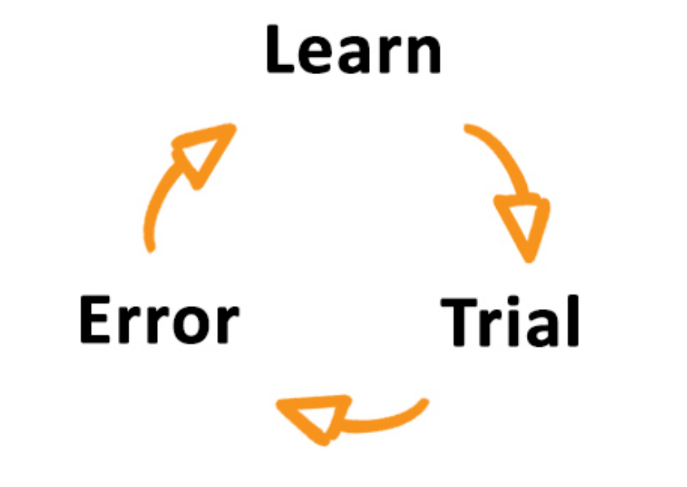
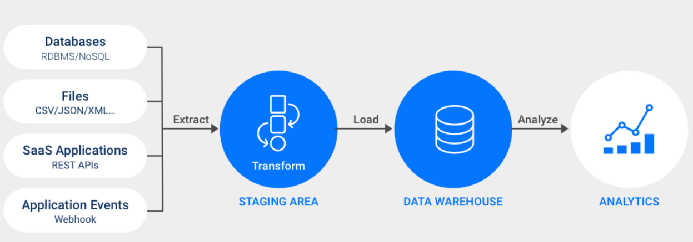

# 수업 Review

---

## 질문할 때 이렇게 하자

**i)** 선택하기 위해서 근거로 찾은 정보들을 잘 모으고 정리한다.

**ii)** 문제를 두세 문장으로 정의하고,  
가능한 선택지를 A, B (필요하면 C…)처럼 **대조군**으로 만든다.

---

**trial**

**iii)** 그 과정에서 잘 안 되거나 막히는 지점을 명확히 한다.  
시도(trial)했지만 예상과 다른 결과가 나온 부분을 정리한다.

---

**error**

---

피넛버터 토스트 영상을 보면서  
설명만으로는 소통이 쉽지 않다고 느꼈다. _(uncertainty가 높다)_

→ 이런 상황에서는 한 번에 이해하려 하기보다  
→ **trial → error를 여러 번 반복하는 게 낫다**

---

## Actionable Data

**행동으로 이어질 수 있는 정도까지 정리된 정보**

---

### Candy Crush Saga 사장이라면?

#### 광고 지표 종류

**CPM (Cost per Million)**  
→ 단순 노출 비용  
→ 많이 보여줬다는 정보만 있음

**CPC (Cost per Click)**  
→ 클릭이라는 행동까지 연결됨

**CPI (Cost per Install)**  
→ 실제 설치로 이어졌는지 알 수 있음

단순히 보여준 횟수는 중요하지 않다.

**CPA (Cost per Action)**  
→ 설치 이후 특정 행동까지 측정

---

**이처럼 행동과 직접 연결되는, 더 정확한 데이터가 더 valuable하다.**

---

## 미션 마음가짐

미션을 할 때 완성하기보다,  
**상대방이 어떤 관점으로 바라보는지를 잘 관찰하자.**

---

## Structured Data vs Unstructured Data

Structured data는 **목적의식이 있는 데이터**다.

그냥 쌓아두는 게 아니라,  
→ **어디에 쓸지가 먼저 정해져야 한다.**

예시)  
서울시 강남구 학동로 171 삼익악기빌딩 2층 06046

- 층 정보를 따로 저장할 것인지
- 지번은 어떻게 처리할 것인지

→ 어디에 사용되는지부터 잘 물어보자.  
→ 그게 먼저 명확해야 한다.

---

같은 데이터라도  
기획자, 백엔드 등 **바라보는 관점은 모두 다르다.**

그래서 스키마는 기술 문제가 아니라 **의사결정 문제**다.

---

**구조화 이전의 raw data는 반드시 가지고 있어야 한다.**

---

etc column에 JSON 형식의 데이터  
→ 백엔드가 아직 확신이 없는 상태  
→ 의사소통을 통해 진짜 필요한 정보인지 확인  
→ 하나씩 물어보며 구체화  
→ **빠르게 prototype을 만들어 직접 확인하는 방법**

---

## ETL Process

예전에는  
Data Warehouse에서 처리 비용이 비싼 데이터들을 먼저 다루기 위해  
**Staging Area를 따로 두었다.**

지금은  
Data Warehouse 성능이 좋아지면서  
**Staging Area와 Data Warehouse가 하나로 통합되었다.**

---

### 1. 코드 구조

- 코드는 나눠서 짜야 한다.
- 원래는 Staging Area와 Data Warehouse가 나뉘어 있다.
- 한 함수에 다 박으면 안 된다.

---

### 2. Extract / Transform 분리

- Extract 코드와 Transform 코드는 분리한다.
- Extract를 하면서 Transform을 같이 하지 말자.
- **Extract → Transform** 순서로, 코드도 나눠서 작성한다.

---

★ **3개의 시스템을 별도로 생각해서 나누자**  
(Extract / Transform / Load)

---

### Git 관리 주의사항

- 3MB~5MB 이상 파일은 gitignore에 올리자자.
- AWS key 같은 민감한 정보는 **절대 GitHub에 넣지 않는다.**
